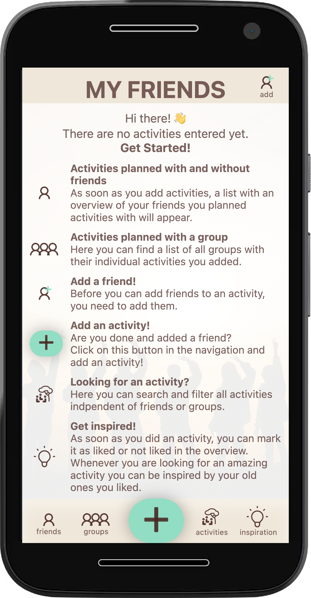

# Capstone Project

This is my capstone project of the web development bootcamp at [neueFische](https://www.neuefische.de/weiterbildung/web-development)

## About the App

Don't you hate these times: friends ask you out for dinner and you keep forgetting the name of this one restaurant you always wanted to go to?
Or just imagine, you see a poster of an upcoming amazing event somewhere and you directly know; I wanna go there with my best friend but how should I remember?
.... Forget these struggles by using Togather!

You can add an activity to your list either linked with a friends name or just for yourself. Later on, when being home and you have time to share it or someone asks, you can check the app and it tells you what you saved for your future activities. Also you can check what you did and linked - get inspired!

## Tech Stack

- [React](https://reactjs.org/)
- [React Router](https://reactrouter.com/)
- [React Testing Library](https://testing-library.com/docs/react-testing-library/intro/) / [Jest](https://jestjs.io/)
- [React Hook Form](https://react-hook-form.com/)
- [Storybook](https://storybook.js.org/)
- [styled components](https://styled-components.com/)
- [axios](https://axios-http.com/)
- [Cloudinary](https://cloudinary.com/home-3722)
- [Zustand](https://www.npmjs.com/package/zustand)

## How to use it?

- Clone the project
- Install: `npm install`
- Tests: `npm test`
- Storybook: `npm run storybook`
- Visible in Browser: `npm start`
